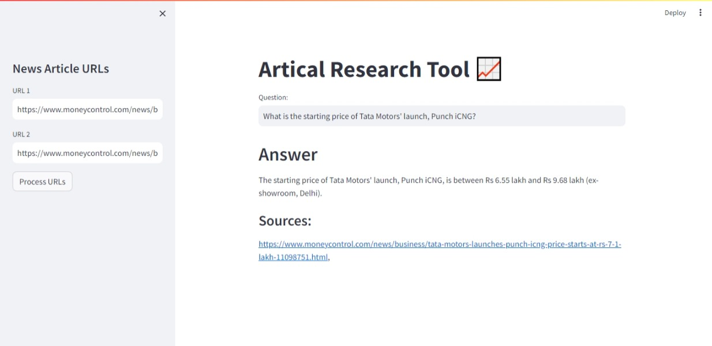

# News Research Chatbot 


News Research Chatbot is an intuitive and user-friendly tool crafted for seamless information retrieval in the ever-dynamic landscape of news and finance. Its design revolves around the user's ease, allowing them to input article URLs effortlessly. This feature empowers users to delve into the vast realms of stock market and financial information, extracting relevant insights with just a few clicks. Whether users seek to stay informed about market trends, analyze financial news, or track specific stocks, the Chatbot streamlines the process by providing swift and tailored responses to user queries.

The Chatbot's versatility extends beyond URL input, as users can pose questions directly. This interactive feature enhances the user experience, allowing for a dynamic exchange of information. By combining the power of advanced language models and efficient processing techniques, the Chatbot transforms the often intricate task of news research into a user-friendly and accessible experience. Whether navigating complex financial reports or staying updated on market developments, users can rely on the Chatbot as their go-to tool for obtaining pertinent insights in a timely and effortless manner.



# Getting Started
  1. Clone the repository:
    https://github.com/devananthans/chatbot.git
  2. Navigate to the project directory:
    cd chatbot
  3. Install the dependencies:
     pip install -r requirements.txt

## Features

- Load URLs or upload text files containing URLs to fetch article content.
- Process article content through LangChain's UnstructuredURL Loader
- Construct an embedding vector using OpenAI's embeddings and leverage FAISS, a powerful similarity search library, to enable swift and effective retrieval of relevant information
- Interact with the LLM's (Chatgpt) by inputting queries and receiving answers along with source URLs.


```
## Usage/Examples

1. Run the Streamlit app by executing:

streamlit run main.py

```

2.The web app will open in your browser.

- On the sidebar, you can input URLs directly.

- Initiate the data loading and processing by clicking "Process URLs."

- Observe the system as it performs text splitting, generates embedding vectors, and efficiently indexes them using FAISS.

- The embeddings will be stored and indexed using FAISS, enhancing retrieval speed.

- The FAISS index will be saved in a local file path in pickle format for future use.
- One can now ask a question and get the answer based on those news articles
- In video tutorial, we used following news articles
  - https://www.moneycontrol.com/news/business/tata-motors-mahindra-gain-certificates-for-production-linked-payouts-11281691.html
  - https://www.moneycontrol.com/news/business/tata-motors-launches-punch-icng-price-starts-at-rs-7-1-lakh-11098751.html
  - https://www.moneycontrol.com/news/business/stocks/buy-tata-motors-target-of-rs-743-kr-choksey-11080811.html

## Project Structure

- main.py: The main Streamlit application script.
- requirements.txt: A list of required Python packages for the project.
- faiss_store_openai.pkl: A pickle file to store the FAISS index.
- .env: Configuration file for storing your OpenAI API key.


If you have More Details Contact Me - **devananthan25@gmail.com**
